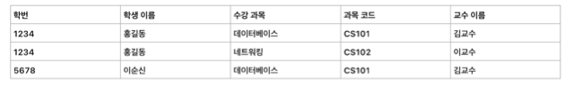

# 데이터베이스

Q. 인덱스?
 A. 인덱스란 추가적인 쓰기(Write) 작업과 저장 공간을 활용하여 테이블의 검색(조회, 정렬, 그룹핑) 속도를 향상 시키기 위한 자료구조입니다. 인덱스를 사용하지 않은 컬럼을 조회 한다면, 전체를 탐색하는 full scan이 수행되야 하기 때문에 대용량에서는 사용되는 쿼리에 따라 적합한 인덱스를 생성해서 사용하는 것이 유용합니다. 인덱스를 통해 검색 속도를 향상시켰기 때문에 select 문의 조회속도는 향상되었지만, write(insert, update, delete)의 경우 인덱스를 관리 해야하는 오버헤드가 발생합니다.

* 특징
    * Select + Where, Join, Order By, Group By에 대해 빠르게 처리할 수 있음
    * PRIMARY KEY constraint가 설정 되었을 경우 인덱스가 자동 생성됨
    * 항상 최신의 정렬상태를 유지함(Clustering Index, No-Clustering Index 모두 포함)
        * Table에 Write(Insert, Update, Delete)할 때마다 Index도 변경 발생
        * 잘 활용되지 않는 인덱스는 과감히 제거
    * 인덱스도 하나의 데이터베이스 객체
    * 데이터베이스 크기의 약 10% 정도의 저장공간 필요
* Full Scan vs Index
    * Full Scan
        * 카디널리티가 작은 경우
        * 데이터가 조금 있는 경우
    * Index
        * 카디널리티가 높은 경우
        * 데이터가 많이 있는 경우
        * Where, Join, Order by, Group by를 자주 사용하는 컬럼
        * Write(Insert, Update, Delete)가 자주 발생하지 않는 컬럼
* Hash Index
    * Hash Table을 사용하여 Index를 구현
    * 시간복잡도 : O(1)
    * Rehashing에 대한 부담이 큼
        * Rehashing : 버킷이 꽉차서 늘리는 작업
    * Equality 비교만 가능, Range 비교 불가능
    * multicolumn의 경우 전체 attributes에 대한 조회만 가능
* 페이지
    * 데이터가 저장되는 단위
    * B-Tree에서 노드 = 페이지
    * 데이터 페이지 = 데이터를 담고 있는 페이지
* B-Tree Index
    * Balanced Binary Search Tree
        * Binary Search Tree = Binary Search + Linked List
        * Balanced -> 트리 높이가 같음
            * 새로운 데이터를 삽입하는 과정에서 정해진 페이지 크기를 벗어나는 경우 페이지 분할이 일어남
        * 자식 노드를 2개 이상 가질 수 있음
    * O(logN)
    * 데이터베이스에서 기본적으로 사용되는 인덱스
    * multicolumn의 경우 전체 attributes 뿐만 아니라 우선순위가 높은 Attribute를 통해 빠른 조회 가능

 Q. Covering Index
 A. 필요한 데이터가 모두 포함있는 인덱스를 의미하는데, 실제 데이터까지 접근을 하지 않고 조회가 가능함

 Q. clustered index vs non-clustered index
 A. (Tree 구조를 가지고 있는 Index에 대해)
* clustered index
    * index에 데이터 페이지가 함께 존재함
    * 테이블당 1개만 존재 가능
    * PRIMARY KEY(우선순위), UNIQUE + NOT NULL를 제약조건으로 적용시 자동 생성
        * 둘다 제약조건으로 적용하면, PRIMARY KEY만 클러스터링 인덱스를 생성
    * 즉, 리프 페이지 = 데이터 페이지
        * 조회 속도가 빠름
    * 데이터 페이지에 실제 데이터가 정렬되어 있어야 함
        * insert, Update, Delete 부하가 많음
* non-clustered index
    * index와 데이터 페이지가 따로 존재함
    * 테이블당 여러 개 존재 가능
    * UNIQUE 제약조건 적용시 자동 생성
    * CREATE (UNIQUE) INDEX를 통해 생성시 non-clustered index를 생성
    * 즉, 리프 페이지가 데이터가 있는 곳의 주소를 가지고 있음
        * 리프 페이지는 여전히 정렬되어 있어야 함
        * 조회 속도가 약간 느림
        * 추가 공간 필요
    * 데이터 페이지에 데이터가 정렬되지 않아도 됨
        * insert, Update, Delete 부하가 적음

Q. 뷰(View)?
 A. 하나 이상의 테이블에서 쿼리를 수행한 결과를 담고있는 가상(실제 저장하지 않은) 테이블입니다. 뷰를 일반 테이블처럼 조회할 수 있으며, 조인문을 많이 호출하는 복잡한 쿼리의 경우 간단하게 만들 수 있습니다.

 Q. 트랜잭션?
 A. 데이터베이스의 상태를 변경시키는 더이상 나눌 수 없는 가장 작은 작업의 단위로 즉, 무조건 한번에 실행되어야 하는 단위를 의미합니다. 이러한 트랜잭션은 4가지 성질(ACID)을 가지고 있는데..
1. 원자성 : 트랜잭션 연산이 데이터 베이스에 모두 반영 되던지 전혀 반영이 되지 않도록 보장하는 특성
2. 일관성 : 데이터 베이스의 상태가 일관되게 유지되어야함
    * 트랜잭션 이후, 데이터 베이스의 제약이나 규칙이 만족되어야 함
3. 독립성(고립성) : 트랜잭션 수행시 다른 트랜잭션이 끼어들 수 없고 독립적으로 수행해야함
4. 지속성 : 트랜잭션이 성공적으로 커밋되었다면 어떠한 문제가 발생해도 데이터 베이스의 내용이 영원히 지속되어야하는 특성

* 커밋 : 해당 트랜잭션으로 반영된 DB 변경 사항을 저장
* 롤백 : 해당 트랜잭션으로 반영된 DB 변경 사항을 취소

* Undo 로그 : 변경전의 값을 기록
* Redo 로그 : 변경후의 값을 기록

 Q. Lock?
 A. 동시성 제어를 위해 트랜잭션이 이용하고 있는 데이터 항목(Row, table)은 해당 트랜잭션이 끝날때 까지 점유하도록 Lock 시키고, 해당 트랜잭션이 끝나면 Unlock시키는 방법입니다. 공유 로킹은 Lock 부분을 읽기는 가능하고 쓰기는 불가능하지만, 배타 로킹은 읽기, 쓰기 둘다 불가능하게 하는 것입니다.

* 교착상태 : 운영체제와 같음
* 교착상태 해결방법 : 상황이 두개라면, 둘 중 하나를 Roll back하고 나머지 하나를 완료 시키고 roll back한 트랜잭션을 실행

 Q. 슈퍼키? 후보키? 기본키? 대체키? 외래키?
 A.
* 슈퍼키 : 각 행을 유일하게 식별할 수 있는 하나 또는 그 이상의 속성들의 집합입니다.(유일성)
* 후보키 : 각 행을 유일하게 식별할 수 있는 최소한의 속성들의 집합입니다.(유일성 + 최소성)
* 기본키 : 후보키들 중에서 하나를 선택한 키입니다.
* 대체키 : 기본키로 지정하고 남은 후보키들 입니다.
* 외래키 : 다른 테이블의 기본키를 참조하는 속성입니다.

 Q. 정규화?
 A. 데이터의 중복을 해소하기 위해서 테이블을 분해하는 과정입니다. 데이터가 중복이 되면 이상현상이 발생하는데 삽입 이상, 갱신 이상, 삭제 이상이 발생합니다.

 
* 삽입 이상
    * 데이터를 삽입하기 위해 불필요한 데이터도 함께 삽입해야 하는 문제
    * 새 과목을 반영하려면, 학번과 학생 이름도 반영해야함
* 갱신 이상
    * 중복되는 레코드들 중 일부만 변경하여 데이터가 불일치하게 되는 문제
    * 김교수를 김철수를 일부만 수정하면 문제가 됨
* 삭제 이상
    * 레코드를 삭제하면 꼭 필요한 데이터까지 같이 삭제되는 데이터 손실 문제
    * 2번째 레코드를 지우면 네트워킹 과목도 함께 사라짐

 Q. DB Replication? master-slave?
 A. DB에서 데이터는 아주 중요하기 때문에 데이터를 백업해 두기 위해 용량을 더 사용해서 데이터를 똑같이 복제(Replication)를 합니다. 여기서 복제 되는 데이터 베이스를 master, 복제를 받는 데이터 베이스를 Slave라고 합니다. Slave는 Master와 동기화 되지만, Master는 Slave와 동기화 되지 않아 복제가 단방향으로 이루어지는 것이 특징입니다. 그리고 Insert / Update / Delete 쿼리는 master가 담당하고, Select 쿼리는 slave가 담당하도록 하여 트래픽 분산에 응용할 수 있습니다.

 Q. Database의 샤딩(Sharding)?
 A.
* Horizontal(수직) Partitioning이랑 같은 의미로, 같은 테이블 스키마를 가진 데이터를 분할하여 **다수의 데이터베이스**에 저장하는 것을 의미합니다.(여러 shard에 저장함)
    * 보통 트래픽 분산을 목적으로 이루어집니다.
    * 데이터가 너무 많아서 검색이 느려지는 경우에 사용합니다.
* 중요하게 고려해야할 사항으로는 분산된 Database에서 Data를 어떻게 read 할지, 트래픽이 한쪽으로 몰리지 않게 어떻게 잘 분산시켜서 저장할 것인가에 대한 문제가 있습니다.

 Q. Database의 clustering?
 A.
* database의 경우 요청을 처리하는 DB server + 데이터가 저장되는 DB storage로 구성되어 있는데, DB server를 여러 개 두어서 DB server에 대한 장애에 대비할 수 있는 방법입니다.

 Q. DML? DDL? DCL?
 A.
* DML(Data Manipulation Language)
    * 데이터를 조작(선택, 삽입, 수정, 삭제)하는데 사용하는 구문
    * Select : (데이터베이스 내) 데이터 조회
    * Insert : (테이블 내) 데이터 삽입
    * Update : (테이블 내 )데이터 수정
    * Delete : (테이블 내) 데이터 삭제
* DDL(Data Definition Language)
    * 데이터베이스 개체(데이터 베이스, 테이블, 뷰, 인덱스)를 생성, 삭제, 변경하는 구문
    * Create : 데이터베이스 개체 정의(생성)
    * Drop : 데이터베이스 개체 삭제
    * Alter : 데이터베이스 개체 정의 변경(수정)
* DCL(Data Control Language)
    * 사용자에게 어떤 권한을 부여하거나 빼앗을 때 사용하는 구문
    * Grant : 사용자에게 권한 부여
    * Revoke : 사용자에게 권한 취소
    
 Q. inner join vs outer join
 A.
* join
    * 여러 테이블에서 가져온 레코드를 조합하여 하나의 테이블로 표현하는 것
* inner join
    * 서로의 테이블에 모두 존재하는 데이터만 조회됨
* outer join
    * left / right를 통해 기준 테이블을 지정함
        * 기준 테이블에 대응되는 테이블이 조인 테이블(=참조 테이블)이라고 함
    * 기준 테이블에 존재하는 데이터를 기준으로 조회됨

 Q. 데이터 무결성? 데이터 일관성?
 A.
* 데이터 무결성 : 데이터베이스에 설정된 규칙과 제약 조건을 통해 데이터가 정확하고 신뢰할 수 있도록 보장하는 특성
* 데이터 일관성 : 데이터베이스 내에 모든 데이터가 서로 모순되지 않고, 관계된 데이터 간에 항상 일관된 상태를 유지하는 특성

 Q. RDB? NoSQL?
 A.
* RDB(Relational Data Base)
    * 특징
        * 2차원 형태의 테이블 형태로 데이터를 저장함
        * 엄격한 스키마를 가지고 있음
        * 테이블들 간에 관계를 가지고 있음
        * Transaction의 ACID를 보장하면서 성능(High-Throughput, Low-Latency)이 떨어짐
    * 장점
        * 엄격한 스키마에 따라 데이터를 저장하기 때문에 데이터 무결성, 데이터 일관성을 보장할 수 있음
        * 데이터를 중복없이 저장하여 수정하기에 용이함
    * 단점
        * 새로운 컬럼을 추가하기 위해서는 명확한 스키마를 변경해야 해서 위험 부담이 존재하고, 유연한 확장이 부족함
        * 중복을 제거하기 위해 테이블들을 분리하여 원래 테이블을 가져오기 위해서는 많은 Join이 필요함(-> Overhead, 응답시간 지연)
        * Scale-Up만 용이함, Scale-Out으로 성능 향상 하기에는 부적합하여 대용량 데이터에 대해서 대응하기 어려움
        * 비정형 데이터에 대해 스키마를 정의하고 데이터를 저장하기 까다로움
    * 언제사용?
        * 데이터 구조가 명확하여 구조변경 가능성이 낮은 경우
        * 중복이 없기 때문에 값이 자주 변경 되는 경우
* NoSQL(Not Only SQL)
    * 특징
        * 스키마를 가지고 있지 않음
        * 데이터들 간에 관계가 존재하지 않음
        * Transaction의 ACID를 일부 포기해서 성능(High-Throughput, Low-Latency)을 향상시킴
    * 장점
        * 스키마가 없기 때문에 편리하게 데이터 구조를 조정할 수 있음
        * 중복을 허용해서 join을 안해도 되고, Scale-Out에 용이하여 대용량 데이터에 대응 할 수 있음
    * 단점
        * 중복된 데이터를 수정할 때 모든 컬렉션에서 수정해야함
        * 스키마가 없어서 규격화된 결과값을 얻기 힘듬
    * 언제사용?
        * 정확한 데이터 구조를 알 수 없거나 구조가 변경/확장 될 수 있는 경우
        * 대용량 데이터를 저장하고 있는 경우(-> Scale-Out)